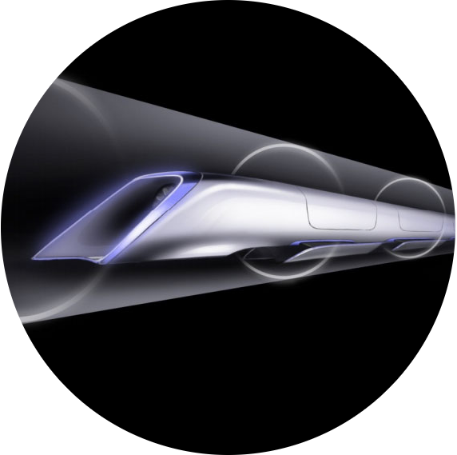

<!-- .slide: data-background="media/img/aframe.jpg" -->

<div class="talk-title">
  <h1>A-Frame</h1>
  <p>Realidad Virtual para la Web</p>
  <p class="talk-info">
    @fabiojcortes | @bogodev | **aframe.io**
  </p>
</div>

<!-- NOTES -->
- Onboard en el mundo 3D and VR con herramientas fáciles de usar
- Prototipar experiencias WebVR rápidamente

------

# Realidad Virtual

<!-- .slide: data-background-video="media/video/virtualreality.mp4" data-background-video-loop="true" data-background-video-muted="true" data-state="state--bg-dark" -->

<!-- NOTES -->
- Preguntar cuántos han usado VR.
- VR en una plataforma tecnológica que nos transporta a ambientes 3D, realistas, interactivos e inmersivos
- Es al futuro de las plataformas, cambiará como trabajamos, como jugamos, como nos comunicamos digitalmente

---

<div class="image-row">
  <div></div>
  <div></div>
  <div></div>
</div>

<div class="image-row">
  <div></div>
  <div></div>
  <div></div>
</div>

<!-- NOTES -->
- Respaldado por grandes compañías tecnológicas
- Existen opciones de todos los rangos de precio, atados o libres, diferentes opciones de controles etc.
- HTC Vive + Steam => Top experience

---

## Fricción de los sistemas de VR

<div class="captioned-image-row">
  <div>
    
    <i>Protegidos</i>
  </div>
  <div>
    
    <i>Instalaciones</i>
  </div>
  <div>
    
    <i>Cerrados</i>
  </div>
</div>

<!-- NOTES -->
- App stores y corporaciones controlan la distribución: Pueden tumbar o bloquear contenido
- Descargas e instalaciones son una barrera al consumo, sobretodo para plataformas pequeñas
- Ecosistemas cerrados, los motores son de propietarios, dificultan las curvas de aprendizaje, compatibilidad
- Queremos que el VR progrese? Queremos una plataforma sin esta fricción, la respuesta es WebVR...

------

# WebVR

Una plataforma de VR abierta, con las ventajas **la Web**

<div class="captioned-image-row">
  <div>
    
    <i>Abierto</i>
  </div>
  <div>
    
    <i>Conectado</i>
  </div>
  <div>
    
    <i>Instantaneo</i>
  </div>
</div>

<!-- NOTES -->
WebVR es... VR en el browser, potenciado por el internet

Abierto:
- Cualquiera puede publicar
- Open source culture with open standard
- Cultura open source con estándares abiertos

Conectado:
- Mundos transversales

Instantaneo:
- Click a link redes sociales: Experiencia VR inmediata
- Sin instalaciones

Transition:
- Web tiene ventajas que la hacen la mejor plataforma para la gente

---


Los navegadores tienen APIs que permiten el render en Headsets
y acceder a los sensores de VR

https://w3c.github.io/webvr/

<!-- NOTES -->
API:
- render path optimizado para headsets
- Acceder a datos de posición y rotación

Historia:
- Se basan el WebVR API inicial de Mozilla
- Mozilla, Google, Samsung, Microsoft, la comunidad esta iterando sobre el WebVR 1.0 API

No es solo una especificación, esta implementado...

---

https://webvr.rocks

<div class="captioned-image-row small">
  <div>
    
    <i>Firefox</i>
  </div>
  <div>
    
    <i>Microsoft Edge</i>
  </div>
  <div>
    
    <i>Chromium</i>
  </div>
</div>

<div class="captioned-image-row small">
  <div>
    
    <i>Chrome for Android</i>
  </div>
  <div>
    
    <i>Oculus Carmel</i>
  </div>
  <div>
    
    <i>Samsung Internet</i>
  </div>
  <div>
    
    <i>Mobile Polyfill</i>
  </div>
</div>

<!-- NOTES -->
- Funciona en la mayoría de navegadores
- Mobile Polyfill: usa los sensores de orientación y movimiento en smartphones
- Todos los navegadores estan tras el...

---

## Metaverse

<!-- .slide: data-background="media/img/metaverse.jpg" -->

<!-- NOTES -->
- Compartir experiencias VR
- Realidad digital alterna, jugar, trabajar, aprender...
- Dónde empezamos?
- three.js abstrae WebGL, 3D, y WebVR, pero podría ser mejor...

---

Es muy difícil crear experiencias de WebVR...

---

<!-- .slide: data-background-video="media/video/boilerplate.mp4" data-state="state--bg-dark" -->

<div class="slide__boilerplate">
  <p>Import WebVR polyfill</p>
  <p>Set up camera</p>
  <p>Set up lights</p>
  <p>Initialize scene</p>
  <p>Declare and pass canvas</p>
  <p>Listen to window resize</p>
  <p>Install VREffect</p>
  <p>Instantiate renderer</p>
  <p>Create render loop</p>
  <p>Preload assets</p>
  <p>Figure out responsiveness</p>
  <p>Deal with metatags and mobile</p>
</div>

<!-- NOTES -->
- Sigue siendo difícil crear experiencias de WebVR
- gran obstáculo para hacer pequeños protipos y experimentos
- El código debe actualizarse a las últimas versiones de WebVR, three.js, y a los navegadores
- Si encapsulamos todo esto en una linea...

------

# A-Frame

<!-- .slide: data-background="media/img/aframe-rendered-full.png" -->

Un framework web para crear experiencias de Realidad Virtual

<!-- NOTES -->
- Why:
  - Fácil para web devs crear contenido en VR, sin saber de gráficos 3D
  - Prototipar y experimentar WebVR y VR UX rápido
  - Un vehículo para disparar el ecosistema de VR

---

## Hello World

<!-- .slide: data-background="media/img/aframe.jpg" data-transition="slide-in none" -->

```html
<html>
  <script src="https://aframe.io/releases/0.8.2/aframe.min.js"></script>
  <a-scene>


  </a-scene>
</html>
```
<!-- .element: class="stretch" -->

<!-- NOTES -->
- Solo HTML
- Pon un script tag, no hay build!
- Usa elementos HMTL personalizados
- Una linea de HTML `<a-scene>` maneja todo:
  - canvas, camera, renderer, lights, controls, render loop, WebVR polyfill, VREffect

---

## Hello World

<!-- .slide: data-background="media/img/aframe.jpg" data-transition="fade-in slide-out" -->

```html
<html>
  <script src="https://aframe.io/releases/0.8.2/aframe.min.js"></script>
  <a-scene>
    <a-box color="#4CC3D9" position="-1 0.5 -3" rotation="0 45 0"></a-box>
    <a-cylinder color="#FFC65D" position="1 0.75 -3" radius="0.5" height="1.5"></a-cylinder>
    <a-sphere color="#EF2D5E" position="0 1.25 -5" radius="1.25"></a-sphere>
    <a-plane color="#7BC8A4" position="0 0 -4" rotation="-90 0 0" width="4" height="4"></a-plane>
    <a-sky color="#ECECEC"></a-sky>
  </a-scene>
</html>
```
<!-- .element: class="stretch" -->

<!-- NOTES -->
- Primitivas básicas de 3D con elementos personalizados
- Fácil de leer: HTML es el lenguaje mas accesible!
- Miremos un ejemplo en vivo...

---

## Homer's Metaverse

<!-- .slide: data-background="media/img/metaverse.jpg" -->

<div class="stretch">
<iframe width="900" height="469,75" src="https://truthful-winter.surge.sh/" style="border: none; margin-top: 40px"></iframe>
</div>

<!-- NOTES -->
- A-Frame corriendo en mis slides HTML
- Funciona en desktop, Android, iOS, Samsung Gear VR, Oculus Rift, HTC Vive
- Podría abrir incluso el inspector y cambiar algunos valores, ya que es solo HTML

---

<!-- .slide: data-background="media/img/aframe.jpg" -->

## Compatible con todo!

<div class="captioned-image-row">
  <div>
    
    <i>d3.js</i>
  </div>
  <div>
    
    <i>Vue.js</i>
  </div>
  <div>
    
    <i>React</i>
  </div>
  <div>
    
    <i>Redux</i>
  </div>
  <div>
    
    <i>jQuery</i>
  </div>
  <div>
    
    <i>Angular</i>
  </div>
</div>

<!-- NOTES -->

- Basado en HTML, compatible con todas las librarias/frameworks
- Básicamente A-Frame es un framework extensible y declarativo de three.js

------

# Una forma sencilla pero poderosa para crear VR

<!-- .slide: data-background="media/img/aframe.jpg" -->

<!-- NOTES -->
- 3D/VR son diferentes, hay miles de opciones, tipos y complejidades
- Necesitamos una forma sencilla de crear diferntes tipos de aplicaciones
---

<!-- .slide: data-background="media/img/aframe.jpg"  -->

## Todo tipo de assets

* Imágenes posicionales, 360, texturas
* Videos posicionales y 360
* Modelos 3D

<!-- NOTES -->
- Maneja todo tipo de assets.
- Componentes externos para manejar modelos 3D mas complejos

---

## Todo tipo de assets

<!-- .slide: data-background="media/img/aframe.jpg" -->

<div class="stretch">
<iframe width="900" height="469,75" src="https://normal-sink.surge.sh/" style="border: none; margin-top: 40px"></iframe>
</div>

<!-- NOTES -->
- No necesariamente debe ser VR
- A-Frame sirve para crear experiencias 3D en la web

---

<!-- .slide: data-background="media/img/standard-components.png" data-background-size="contain" -->

<!-- NOTES -->
- Estos son algunos componentes que vienen con A-Frame
- - El core de A-Frame es muy extensible así que...

---

<!-- .slide: data-background="media/img/community-components.png" data-background-size="contain" -->

<!-- NOTES -->
- La comunidad ha creado muchos componentes
- Los componentes que crees pueden hacer loq quieras, tienen acceso total a three.js y a los Web APIs
- Física, leap motion, sistemas de particulas, visualizacion de audio etc etc
- El trabajo de grandes desarrolladores al alcance de todos

---

# Registry

<!-- .slide: data-background-color="#333" -->

Colección de los mejores componentes de A-Frame

<a class="stretch" href="https://aframe.io/aframe-registry">
  <video loop data-src="media/video/registrypreview.mp4" data-autoplay></video>
</a>

<!-- NOTES -->
- Es como una tienda de componentes top
- Todos pueden entrarm buscar e instalar

---

# Registry

<!-- .slide: data-background-color="#333" -->

Colección de los mejores componentes de A-Frame

<video loop data-src="media/video/leaphands.mp4" data-autoplay></video>

---

## Inspector

<!-- .slide: data-background="media/img/inspector.png" data-state="state--bg-dark" -->

Inspector visual para A-Frame => `<ctrl>+<alt>+i`.

<div class="stretch" data-aframe-scene="scenes/80s.html"></div>

------

<!-- .slide: data-background="media/img/header.png" -->

# Comunidad

https://aframe.io/blog/

<!-- NOTES -->
- La comunidad de VR mas grande del mundo
- Week of aframe

---

<!-- .slide: data-background="media/img/apainter.gif" -->

# Arte - *A-Painter*

@mozillavr

<!-- NOTES -->
- Basado en Tilt Brush de Google
- 100% web - tilt brush solo para HTC y Oculus
- Sin instalaciones

---

<!-- .slide: data-background="media/img/syria.gif" -->

# Periodismo - *Fear of the Sky*

Amnesty International UK

<!-- NOTES -->
- "Documental" interactivo sobre la situación en siria
- Devastación de las barrel bombs

---

<!-- .slide: data-background="media/img/mars.jpg" -->

# Periodismo - *Journey to Mars*

The Washington Post

<!-- NOTES -->
- Viaje interactivo por marte

---

<!-- .slide: data-background="media/img/citybuilder.gif" -->

# Sandbox - *City Builder*

@kfarr

<!-- NOTES -->
- Crear ciudades con controles táctiles en VR
- Open source

---

<!-- .slide: data-background="media/img/a-blast.gif" -->

# Gaming - *A-Blast*

@mozillavr

<!-- NOTES -->
- Shooter en VR hecho por mozillavr
- Open source

---

<!-- .slide: data-background="media/img/math.gif" -->

# Matemáticas - *MathworldVR*

@sleighdogs

<!-- NOTES -->
- Plataforma de matemáticas hecha en VR

---

<!-- .slide: data-background="media/img/ar.gif" -->

# AR - *AR.js + A-Frame*

@jerome_etienne

<!-- NOTES -->
- AR en para los proyectos de aframe

---

<!-- .slide: data-background="media/img/webvrstudio.png" -->

# Tools - *Ottifox*

@ottifox

<!-- NOTES -->
- Programa de MAC para cerar VR y AR

---

<!-- .slide: data-background-video="media/video/livetour.mp4" data-background-video-loop="true" -->

# Tours - *Live Tour*

iStaging

<!-- NOTES -->
- Live tours platfrom

---

<!-- .slide: data-background="media/img/cadavr.gif" -->

# Educación - *CadaVR*

@drryanjames

<!-- NOTES -->
- Anatomía y medicina en VR

---

# aframe.io

<div class="captioned-image-row">
  <div>
    
    <i>230+ contributors 8000+ Stargazers</i>
  </div>
  <div>
    
    <i>4500+ miembros en Slack</i>
  </div>
  <div>
    
    <i>100s de proyectos compartidos</i>
  </div>
</div>

<!-- NOTES -->
- Open source
- Todo en github
- Comunidad activa en slack

------

<!-- .slide: data-background="media/img/vrbrowser.jpg" -->

#VR Browsers

---

<!-- .slide: data-background="media/img/supermedium.jpg" -->

#Supermedium

@supermediumvr


---

<!-- .slide: data-background="media/img/lensvr.png" -->

#Lens VR

@LensVRBrowser

---

<!-- .slide: data-background="media/img/mozilla-vr.jpg" -->

#Firefox Reality

@mozillareality

------

<!-- .slide: data-background="media/img/aframe.jpg" -->

#Aprende A-Frame!

---

<!-- .slide: data-background="media/img/PortadaVR.jpg" -->

<div class="talk-title">
  <p class="links">skl.sh/2x4jGNc</p>
  <p class="links">github.com/fcor/aframe-workshop/</p>
  <p class="talk-info">
    @fabiojcortes | **fjcr.pro**
  </p>
</div>
